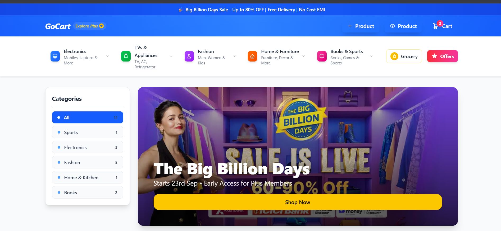
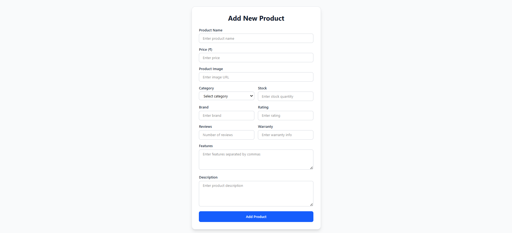
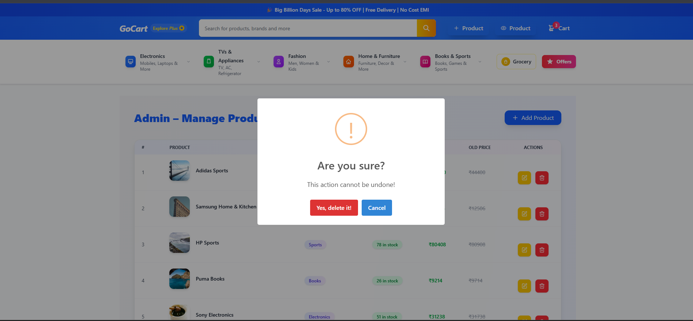
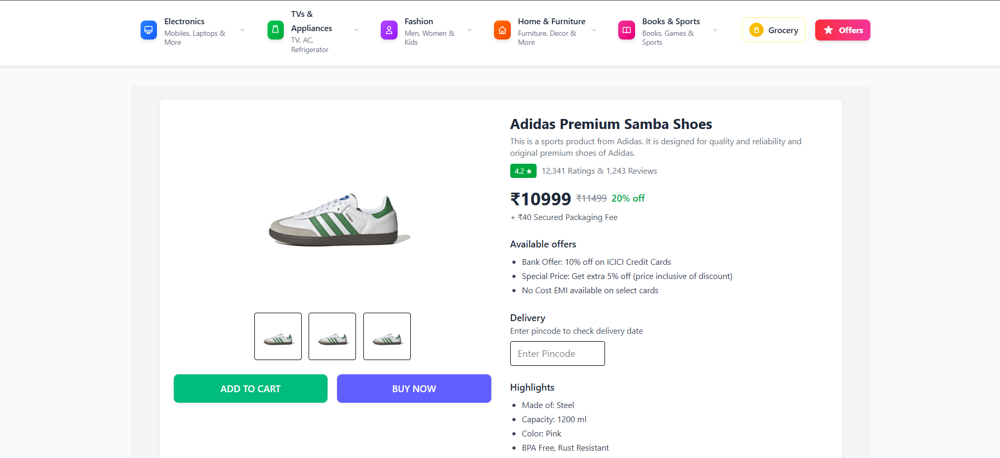
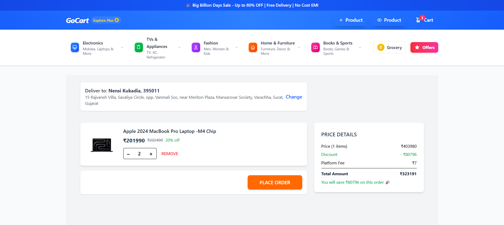
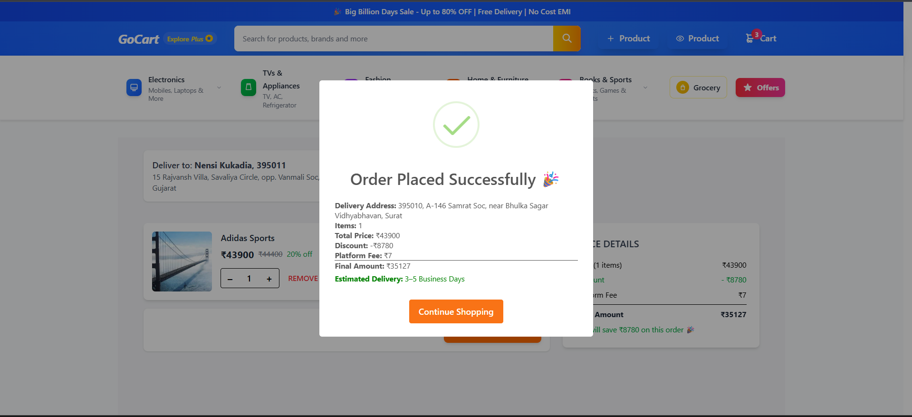
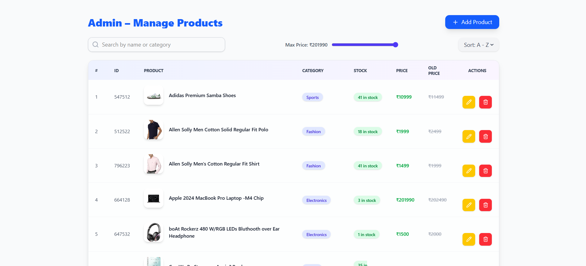
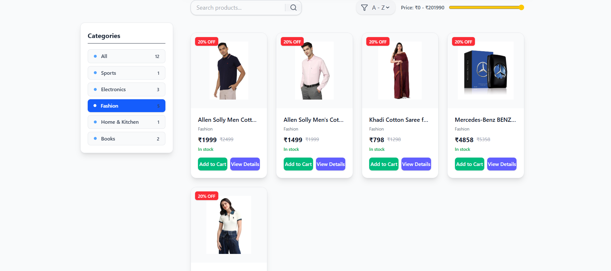

# GoCart - E-Commerce Web Application

GoCart is a modern e-commerce web application built with **React**, **Tailwind CSS**, and **React Router**. Users can browse products, filter, search, sort, add to cart, and place orders seamlessly.

## 📷 Screenshots

<div style="display: flex; flex-wrap: wrap; gap: 10px;">
  
  
  
  
  
  
  
  
</div>

---

## 🌟 Features

### 🛒 Product Management (CRUD)
- **Create**: Admin can add products with name, price, category, stock, image, rating, reviews, warranty, and description.
- **Read**: Users can view all products in a grid layout.
- **Update**: Admin can edit existing products.
- **Delete**: Admin can remove products.

### 📄 Product Details Page
- View full product details: image, description, features, stock, price, and discount.
- Accessible via **View Details** button.

### 🛍️ Shopping Cart
- Add products to cart.
- Adjust product quantity.
- Remove items.
- View total price.
- Place orders with confirmation.

### 🔍 Search, Filter & Sort
- **Search**: By name, category, or ID.
- **Filter**: By category or price range.
- **Sort**: Alphabetically (A-Z, Z-A).

### 📱 Responsive UI
- Sidebar for categories.
- Product grid adjusts based on screen size.
- Carousel for featured promotions.
- Clean, modern styling with Tailwind CSS.

### 🔔 Notifications
- Toast notifications for actions like adding to cart, order confirmation, or errors.

---

## 🛠 Tech Stack
- **Frontend**: React, React Router, Tailwind CSS
- **State Management**: useState, useEffect
- **API Services**: CRUD operations with productAPIServices
- **Notifications**: react-toastify
- **Icons**: Lucide React

---

## 📁 Project Structure

```
src/
├─ components/
│  ├─ Navbar.tsx
│  ├─ ProductCard.tsx
│  └─ ...
├─ pages/
│  ├─ HomePage.tsx
│  ├─ ViewProductDetail.tsx
│  ├─ AddProductForm.tsx
│  └─ AddToCartPage.tsx
├─ Service/
│  └─ ProductAPIService.ts
└─ App.tsx
```

---

## 🚀 Getting Started

1. **Install dependencies**
```bash
npm install
```

2. **Run the application**
```bash
npm start
```

3. **Navigate the app**
- Browse products on **Home Page**
- Search, filter, and sort products
- Click **View Details** for more info
- Add products to **Cart**
- Place orders from the **Cart page**
- Admin can manage products via CRUD operations

---

## ⚡ Future Improvements
- User authentication and roles (Admin/User)
- Integrate with backend API for persistent storage
- Add payment gateway for checkout
- Product recommendation and personalized suggestions

---

## 📄 License
This project is licensed under the MIT License.

Author
~ Nensi Kukadia