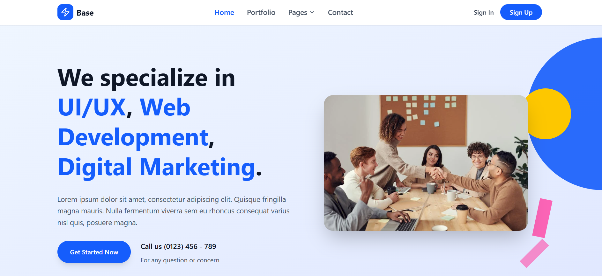
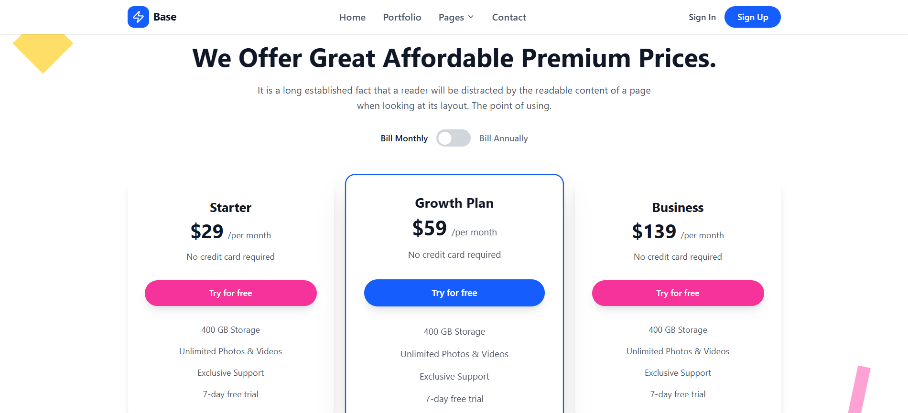
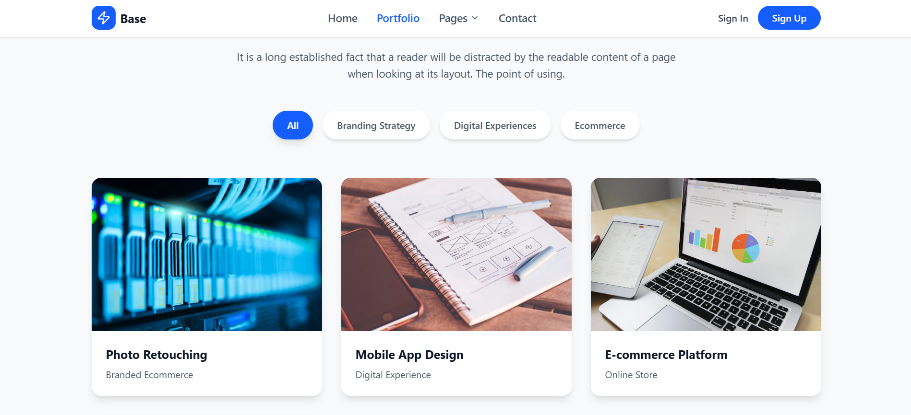
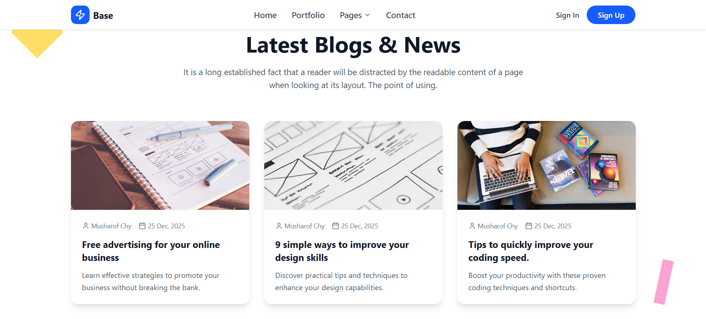
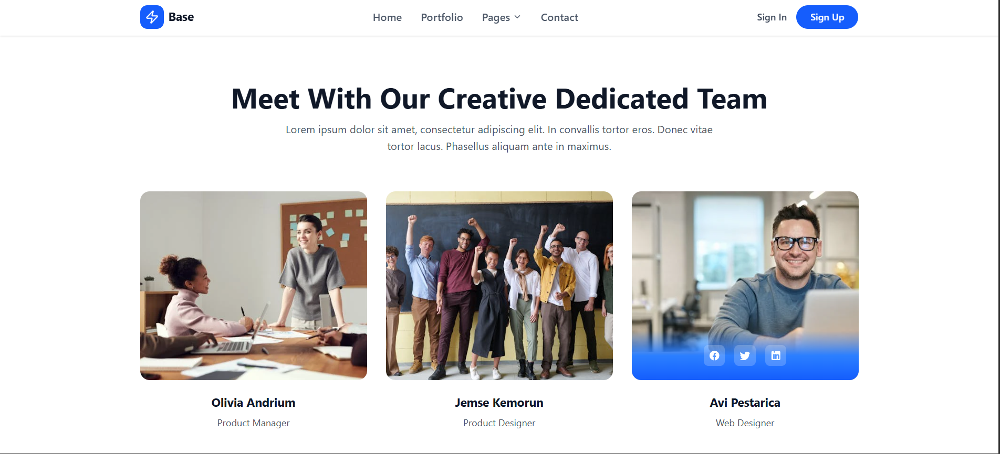
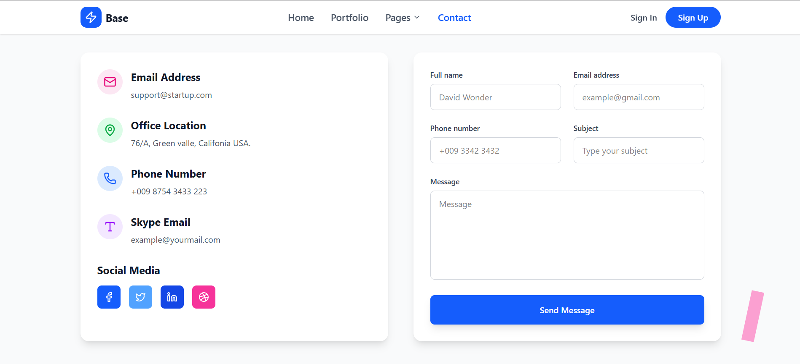

# 🛒 Base - React + Tailwind Website

A modern **React + Tailwind CSS** multi-page website built with **React Router v6+ Data Router API**.  
This project demonstrates clean UI design with reusable components such as Navbar, Footer, and multiple pages.

---

## 📸 Screenshots

> Replace these image links with your actual screenshots.  
> You can put them inside `/public/screenshots/` or upload them to GitHub and update the paths.

### 🏠 Home Page


### ℹ️ Pricing Page


### 🖼️ Portfolio Page


### 📝 Blog Page


### 👥 Team Page


### 📞 Contact Page

---

## 📌 Features

- ⚡ Built with **React + TypeScript**
- 🎨 Styled using **Tailwind CSS**
- 🛣️ Routing with **React Router v6+ (createBrowserRouter)**
- 📱 Fully responsive (mobile-first design)
- 🔄 Reusable components (Navbar, Footer, Cards, etc.)

---

## 📂 Folder Structure

```
base/
├── src/
│   ├── components/        # Reusable UI components
│   │   ├── Navbar.tsx
│   │   ├── Footer.tsx
│   ├── Pages/             # Page components
│   │   ├── Home/HomePage.tsx
│   │   ├── About/AboutPage.tsx
│   │   ├── Portfolio/PortfolioPage.tsx
│   │   ├── Blog/BlogPage.tsx
│   │   ├── Contact/ContactPage.tsx
│   │   ├── Features/FeaturePage.tsx
│   │   ├── Services/ServicePage.tsx
│   │   ├── Pricing/PricingPage.tsx
│   │   ├── Team/TeamPage.tsx
│   │   ├── Testimonials/TestimonialPage.tsx
│   │   ├── Stats/StatsPage.tsx
│   │   ├── Why Choose Us/WhyChooseUsPage.tsx
│   ├── routes/
│   │   └── router.tsx     # Central router config
│   ├── App.tsx            # Layout wrapper
│   ├── main.tsx           # Entry point
│   └── index.css          # Tailwind styles
├── public/
│   └── index.html
├── package.json
└── README.md
```

---

## ⚙️ Installation

1. **Clone the repository**

   ```bash
   git clone https://github.com/your-username/base-react-website.git
   cd base-react-website
   ```

2. **Install dependencies**

   ```bash
   npm install
   ```

3. **Start development server**

   ```bash
   npm run dev
   ```

4. **Build for production**

   ```bash
   npm run build
   ```

---

## 🚦 Routing Setup

The project uses **React Router v6.4+ createBrowserRouter**.

`src/routes/router.tsx`

```tsx
import { createBrowserRouter } from "react-router";
import App from "../App";

import HomePage from "../Pages/Home/HomePage";
import AboutPage from "../Pages/About/AboutPage";
import PortfolioPage from "../Pages/Portfolio/PortfolioPage";
import BlogPage from "../Pages/Blog/BlogPage";
import ContactPage from "../Pages/Contact/ContactPage";
import FeaturePage from "../Pages/Features/FeaturePage";
import ServicePage from "../Pages/Services/ServicePage";
import PricingPage from "../Pages/Pricing/PricingPage";
import TeamPage from "../Pages/Team/TeamPage";
import TestimonialPage from "../Pages/Testimonials/TestimonialPage";
import StatsPage from "../Pages/Stats/StatsPage";
import WhyChooseUsPage from "../Pages/Why Choose Us/WhyChooseUsPage";

export const router = createBrowserRouter([
  {
    path: "/",
    Component: App,
    children: [
      { index: true, Component: HomePage },
      { path: "about", Component: AboutPage },
      { path: "portfolio", Component: PortfolioPage },
      { path: "blog", Component: BlogPage },
      { path: "contact", Component: ContactPage },
      { path: "features", Component: FeaturePage },
      { path: "service", Component: ServicePage },
      { path: "pricing", Component: PricingPage },
      { path: "team", Component: TeamPage },
      { path: "testimonials", Component: TestimonialPage },
      { path: "stats", Component: StatsPage },
      { path: "whyChooseUs", Component: WhyChooseUsPage },
    ],
  },
]);
```

---

## 🌐 Live Demo
[Coming Soon](#)

---

## 🛠️ Built With
- [React](https://react.dev/)
- [TypeScript](https://www.typescriptlang.org/)
- [Tailwind CSS](https://tailwindcss.com/)
- [React Router](https://reactrouter.com/en/main)

---

## 🤝 Contributing
Contributions, issues, and feature requests are welcome!  
Feel free to fork this repo and create a pull request.

---

## 📜 License
This project is licensed under the **MIT License**.
