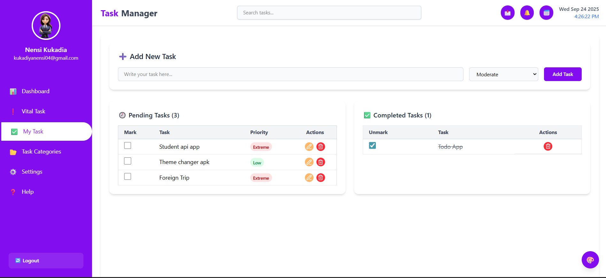
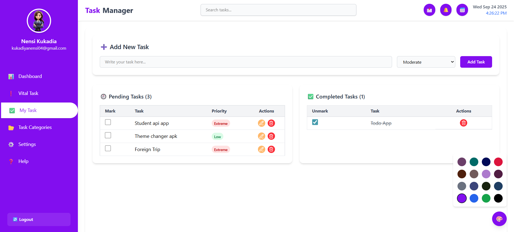
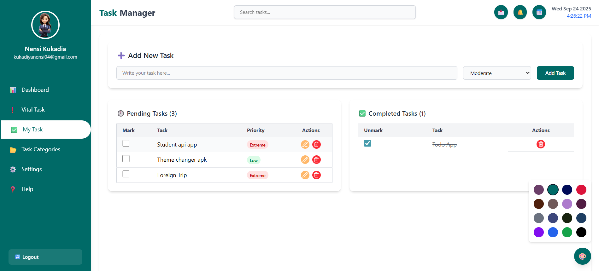
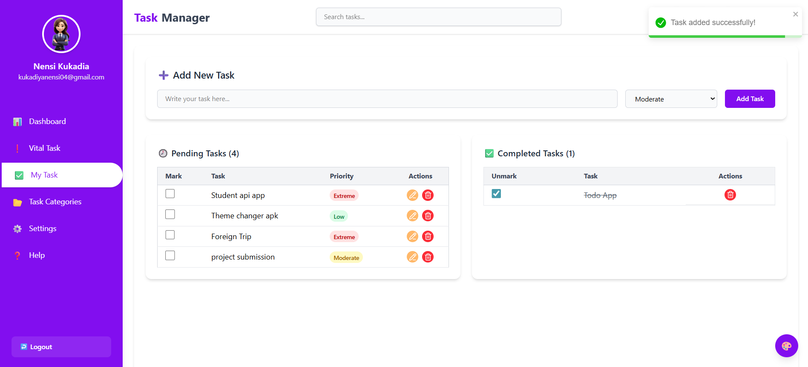

# 📝 Task Manager

A modern **Task Manager Application** built with **React + TypeScript + TailwindCSS**.  
It helps you manage tasks with **priorities, statuses, theme customization, and persistence** using **LocalStorage**.

---

## 🚀 Features

- ✅ **Add, Edit, Delete tasks**
- 🔄 **Update task status** (Pending ↔ Completed)
- 🎯 **Set priority levels** (Extreme, Moderate, Low)
- 🎨 **Change theme color dynamically** (saved in LocalStorage)
- 📅 **Live date and time display** in Navbar
- 📂 **Sidebar navigation** with profile section
- 📢 **Toast notifications** for task actions
- 💾 **Persistent storage** (tasks & theme stored in LocalStorage)
- 📱 **Responsive design** with TailwindCSS

---

## 📸 Screenshots

### Dashboard


### Task Management


### Theme Changer


### Added Task

---

## 🛠️ Tech Stack

- **Frontend:** React, TypeScript, TailwindCSS
- **Icons:** Lucide React
- **Notifications:** React Toastify
- **State Management:** React Hooks (`useState`, `useEffect`)
- **Storage:** LocalStorage (for tasks & theme persistence)

---

## 📂 Project Structure

```
src/
│── App.tsx
│── Components/
│   │── Header/
│   │   └── TodoNavbar.tsx
│   │── SideBar/
│   │   └── TodoSidebar.tsx
│   │── TaskManager/
│   │   └── TaskManagerPage.tsx
│   │── Footer/
│   │   └── TodoFooter.tsx
│── index.css
│── main.tsx
```

---

## ⚡ Installation & Setup

1. **Clone the repo**
   ```bash
   git clone https://github.com/nensi-kukadiya04/TO-DO-APP.git
   cd task-manager
   ```

2. **Install dependencies**
   ```bash
   npm install
   ```

3. **Run the app**
   ```bash
   npm run dev
   ```

4. **Build for production**
   ```bash
   npm run build
   ```

---

## 🎨 Theme Customization

- A floating **color picker button** 🎨 allows you to choose from multiple theme colors.
- Selected theme persists across refresh (stored in **LocalStorage**).

---

## 📌 Roadmap

- [ ] Add authentication system
- [ ] Drag & drop task reordering
- [ ] Task categories & filters
- [ ] Dark mode support

---

## 🤝 Contributing

Contributions are welcome!  
Fork the repository and create a pull request with improvements.

---

## 📜 License

This project is licensed under the **MIT License**.  
Feel free to use and modify for your own projects.

---

### 👩‍💻 Author
**Nensi Kukadia**  
📧 [kukadiyanensi04@gmail.com](mailto:kukadiyanensi04@gmail.com)
